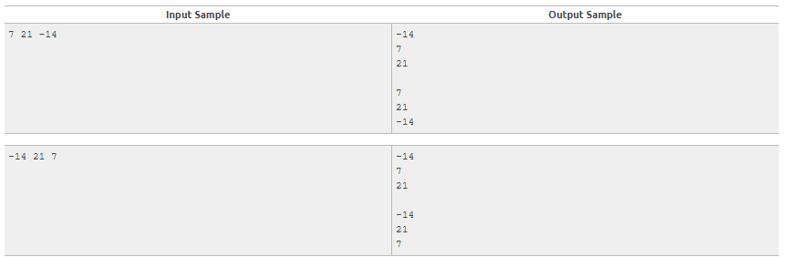

## Simple Sort
### Problem statement

Read three integers and sort them in ascending order. After, print these values in ascending order, a blank line and then the values in the sequence as they were readed.

### Input
The input contains three integer numbers.

### Output
Present the output as requested above.

### Sample Input and output: 
